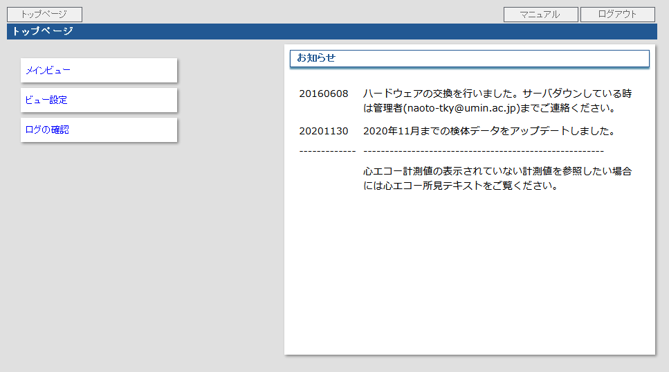

# 研究用検診データベース

ハイメディック検診の症例リスト等を取得したい場合には、研究用検診データベースを使用します。

## データベースの内容について

検診結果のほとんどの情報（画像診断については統合レポートのみ）が入っています。データベースの内容は概ね月に一度、林先生が更新されています（リアルタイムではありません。2021 年 1 月分のデータは 2021 年 2 月頃に反映されます）。

## 使う前に

- 認証は病院の診療端末 ID にて行うため、予め診療端末 ID の取得が必要です。
- 管理者（林先生）にユーザ登録を依頼してください。

## 使い方

1. web ブラウザにて http://172.26.23.196/ へアクセスするとログイン画面が表示されますので、診療端末の ID・パスワードでログインしてください。

2. トップページが表示されたら、左側メニューの[メインビュー]をクリックします。
   

3. メインビューの上部で条件（日付、ビュー(表示項目)など）を指定して [表示] ボタンをクリックします。
   

4. 表示したリストを CSV ファイルで出力する場合は「CSV 取得 URL」右側の [DL] ボタンをクリックしてください（一定時間を経過するとダウンロード出来なくなります）。ダウンロードした CSV ファイルは直ちに Excel にてパスワード付 Excel ブックにした上で、CSV ファイルは削除してください。
   

## 詳しい操作方法について

ログイン後の画面右上にある [マニュアル] ボタンをクリックするとマニュアルのページが表示されます。

## 参考：モダリティと検診日との関係について

モダリティと検診日との関係は概ね以下の通りです。

- 2006.11 - 2017.11.12 (2006.10 はテスト運用のため除外が望ましいです）
  - MR(GE)、PET/CT(GE)
- 2018.3.1 - (2018.2 はテスト運用のため除外が望ましいです)
  - CT(Philips)、MR(Siemens)、PET/MR(Siemens)
  - 2-point dixon 法による全身 MR が撮像されています
